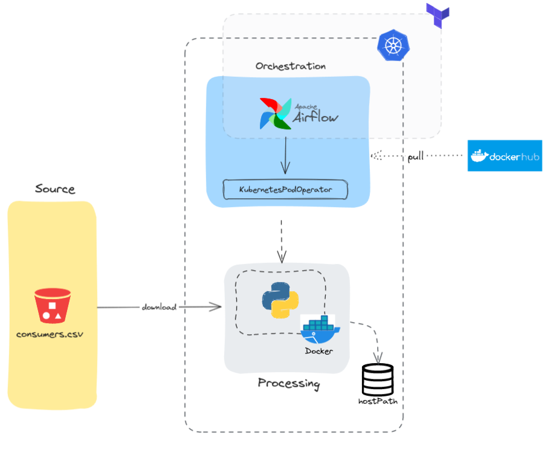

# About the project

This projects aims to deploy an airflow local environment using Terraform as IaC tool which will create the necessary stuffs to run a DAG that show some consumers information.
 and also keeps synchronized with GitHub for new DAGs

The follow architecture diagram follow the idea using "layers" which one is responsible for something. Orchestration layer is designed to just work with orchestration resources, the processing follow the same pattern and so on.



## Getting started

The follow pre-requirements needs to be installed in order to work seamlessly
- [Terraform](https://www.terraform.io/)
- [Kubectl](https://kubernetes.io/docs/tasks/tools/)
- [Docker](https://docs.docker.com/engine/install/)
- [Kind](https://kind.sigs.k8s.io/docs/user/quick-start/)
- [Docker Hub Account](https://hub.docker.com/)


Everything installed successfully, just type the commands:

- ```terraform init```
- ```terraform plan```
- ```terraform apply -auto-aprove```

Wait until the entire stack is being deployed.

Terraform will create some resources as:
- Create a kind cluster with 3 nodes
- Create an airflow namespace
- Install Airflow Helm Charts
- Create a PV and PVC to store tasks logs

Airflow is configured to use GitHub as main source of DAG files. The follow [DAG](https://github.com/tiagotxm/kube-analytics/blob/main/airflow/dags/get_and_show_file.py) is responsible por pulling a Python image hosted on Docker Hub and run a process script to show up customer data.

## Future improvements
- Build a custom CI/CD to deploy images to registry
- Deploy a monitoring and observability stack(e.g Prometheus, Grafana, Opensearch, alert notifications)
- Dag generator based on YAML parameters providing easy way to deploy new DAGs in a scalable and standardized way